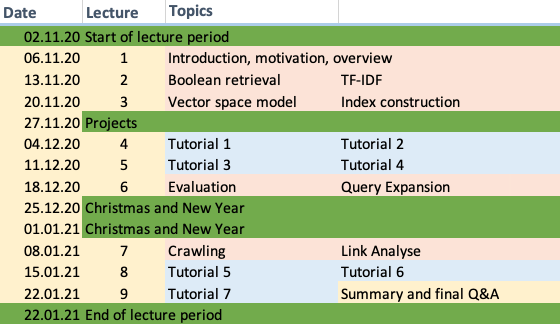

# Information Retrieval 2020 (DIS12) - Solutions to Exercises

## Table of Contents

1. [Table of Contents](##Table-of-Contents)
2. [Schedule and Resources](###Schedule-and-Resources)
3. [Slides and online lecture archive](###Slides-and-online-lecture-archive)
4. [Solutions to the exercises](###Solutions-to-the-exercises)  
    4.1 [Exercise 1](####Exercise-1)  
    4.2 [Exercise 2](####Exercise-2)  

### Schedule and Resources

### Slides and online lecture archive

> For legal reasons the videos were Taken off from the original syllabus as they're only meant for students

| Date                | Topic                                 | Resources      |
|---------------------|---------------------------------------|----------------|
| 2020-11-06 at 13:30 | Syllabus                              | [pdf](slides/DIS12-00-syllabus.pdf) |
| 2020-11-06 at 14:00 | Introduction and Overview             | [pdf](slides/DIS12-01-introduction.pdf) |
| 2020-11-13 at 13:30 | Boolean Retrieval                     | [pdf](slides/DIS12-02-boolean.pdf) |
| 2020-11-13 at 15:15 | TF-IDF                                | [pdf](slides/DIS12-03-tfidf.pdf) |
| 2020-11-20 at 13:30 | Vector Space Model                    | [pdf](slides/DIS12-04-ranking.pdf) |
| 2020-11-20 at 13:30 | Indexing, Terms and Token.s           | [pdf](slides/DIS12-05-index.pdf) |
| 2020-12-04 at 13:30 | Exercise Boolean Retrieval            | [exercise](exercises/DIS12-02-boolean-exercise.pdf) |
| 2020-12-04 at 15:15 | Exercise TF-IDF                       | [exercise](exercises/DIS12-03-tfidf-exercise.pdf), [shakespeare.zip](exercises/shakespeare.zip) |
| 2020-12-11 at 13:30 | Exercise Vector Space Model           | [exercise](exercises/DIS12-04-ranking-exercise.pdf) |
| 2020-12-11 at 15:15 | Exercise Indexing, Terms and Tokens   | [exercise](exercises/DIS12-05-index-exercise.pdf)     |
| 2020-12-18 at 13:30 | Evaluation                            | [pdf](slides/DIS12-06-evaluation.pdf) |
| 2020-12-18 at 15:15 | Query Expansion                       | [pdf](slides/DIS12-07-queryexpansion.pdf) |
| 2021-01-08 at 13:30 | Web Crawling                          | [pdf](slides/DIS12-08-webcrawling.pdf) |
| 2021-01-08 at 15:15 | Link Analysis                         | [pdf](slides/DIS12-09-linkanalysis.pdf) |
| 2021-01-15 at 13:30 | Exercise Evaluation                   | [exercise](exercises/DIS12-06-evaluation-exercise.pdf)    |
| 2021-01-15 at 15:15 | Exercise Query Expansion              | [exercise](exercises/DIS12-07-queryexp-exercise.pdf)    |
| 2021-01-22 at 13:30 | Exercise Web Crawling + Link Analysis | [exercise](exercises/DIS12-08-webcrawling-linkanalysis-exercise.pdf)  |
| 2021-01-22 at 15:15 | Test Exam                             | [test exam](exam/DIS12-10-testexam.pdf)    |

### Solutions to the exercises

#### Exercise 1

| Topic                                 | Resources      |
|---------------------------------------|----------------|
| Mengen und Sets                       | [xlsx](solutions/Exercise_1/Mengen_und_Sets.xlsx)                 |
| Venn Diagramme                        | [pdf](solutions/Exercise_1/Term_Dokument_Matrix.ipynb)            |
| Term-Dokument-Matrix                  | [ipynb](solutions/Exercise_1/Venn-Diagramme.pdf)                  |
| Suche in Shakespeares Gesamtwerk      | [ipynb](solutions/Exercise_1/Shakespeare_gesamtwerk_suche.ipynb)  |

#### Exercise 2

| Topic                                        | Resources      |
|----------------------------------------------|----------------|
| Berechnung von idf                           |            |
| Ein Gefühl für idf bekommen                  |            |
| Berechnung von tf-idf                        |            |
| Verständnisfragen zu idf und Zipfs Gesetz    |            |
| tf-idf in Shakespeares Gesamtwerk            |            |